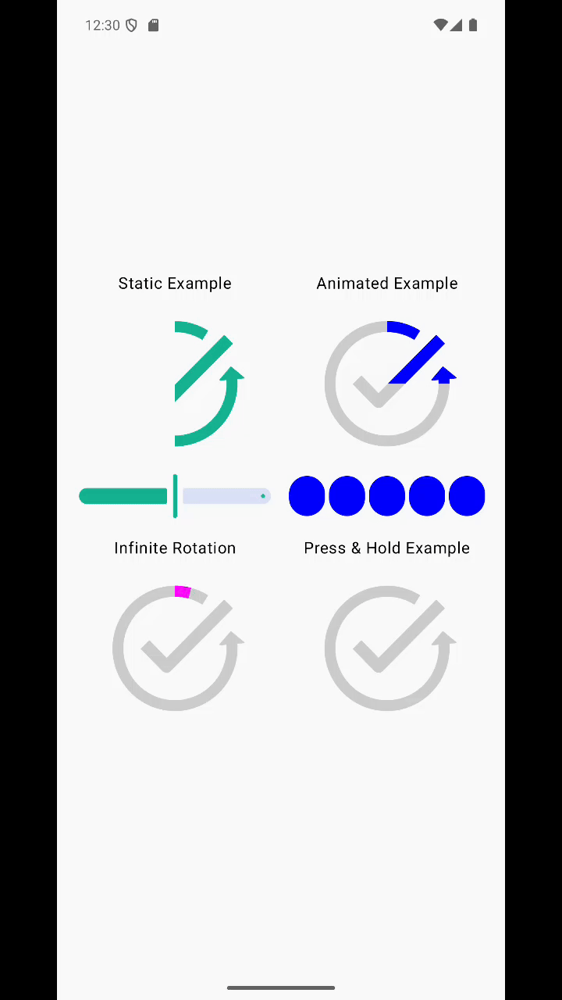

# Circular Progress Image for Jetpack Compose

[](http://developer.android.com/index.html)
[](https://android-arsenal.com/api?level=24)
[](https://opensource.org/licenses/Apache-2.0)
[](https://jitpack.io/#PARAOOO/CircularProgressImage)

This android project is a highly customizable circular progress image component for Jetpack Compose. It clips a given image into a sector shape that dynamically changes based on progress, allowing for beautiful and interactive circular progress indicators.

## Preview



## Features
- **Custom Shape Clipping:** Clips any `Painter` into a dynamic sector shape.
- **Full Angle Control:** Customize the `startAngle` and `maxSweepAngle` to create full circles, semi-circles, or any arc shape you need.
- **Color Theming:** Easily apply tint colors to both the progress and background images.
- **Stateful Animation:** Comes with a state holder (`rememberCircularProgressState`) for effortless animation control.
- **Stateless Control:** Provides a simple, stateless composable for direct progress manipulation.
- **Robust & Edge-Case Ready:** Smoothly handles all progress values from 0% to 100% without visual glitches.

## Setup / Installation

#### 1. Add JitPack Repository

First, add the JitPack repository to your project. This allows Gradle to find and download the library. Choose the file that corresponds to your project's setup style.

<details>
<summary><b>Kotlin DSL (settings.gradle.kts)</b> - Recommended for new projects</summary>

```kotlin
// settings.gradle.kts

dependencyResolutionManagement {
    repositoriesMode.set(RepositoriesMode.FAIL_ON_PROJECT_REPOS)
    repositories {
        google()
        mavenCentral()
        maven { url = uri("https://jitpack.io") } // Add this line
    }
}
```
</details>

<details>
<summary><b>Groovy DSL (settings.gradle)</b> - For older projects</summary>

```groovy
// settings.gradle

dependencyResolutionManagement {
    repositoriesMode.set(RepositoriesMode.FAIL_ON_PROJECT_REPOS)
    repositories {
        google()
        mavenCentral()
        maven { url 'https://jitpack.io' } // Add this line
    }
}
```
</details>

---

#### 2. Add the Library Dependency

Next, add the library dependency to your module's `build.gradle.kts` (or `build.gradle`) file.

<details>
<summary><b>Using Version Catalog (Recommended)</b></summary>

1.  Add the library alias to your `gradle/libs.versions.toml` file.

    ```toml
    [versions]
    # Use a descriptive name for the version key
    circularProgressImage = "1.0.2" # Replace with the latest version

    [libraries]
    # Use a descriptive name for the library alias
    circularProgressImage = { group = "com.github.PARAOOO", name = "CircularProgressImage", version.ref = "circularProgressImage" }
    ```

2.  Add the dependency in your module's `build.gradle.kts`. Gradle automatically handles the alias.

    ```kotlin
    dependencies {
        implementation(libs.circularProgressImage)
    }
    ```
</details>

<details>
<summary><b>Kotlin DSL (build.gradle.kts)</b></summary>

```kotlin
dependencies {
    // Replace "1.0.2" with the latest version from JitPack
    implementation("com.github.PARAOOO:CircularProgressImage:1.0.2")
}
```
</details>

<details>
<summary><b>Groovy DSL (build.gradle)</b></summary>

```groovy
dependencies {
    // Replace "1.0.2" with the latest version from JitPack
    implementation 'com.github.PARAOOO:CircularProgressImage:1.0.2'
}
```
</details>

## Usage

Here are some examples demonstrating the capabilities of the library.

### Example 1: Static Progress with a Slider
A simple example showing a static progress value controlled by an external `Slider`.

```kotlin
var progress by remember { mutableFloatStateOf(0.75f) }

CircularProgressImage(
    painter = painterResource(id = R.drawable.your_image),
    progress = progress,
    modifier = Modifier.size(160.dp),
    color = Color.Green,
    backgroundColor = Color.LightGray.copy(alpha = 0.5f)
)

Slider(value = progress, onValueChange = { progress = it })
```

### Example 2: Controlled Animation with Buttons
Use `rememberCircularProgressState` and `AnimatedCircularProgressImage` to control animations programmatically.

```kotlin
val progressState = rememberCircularProgressState(initialProgress = 0f)

AnimatedCircularProgressImage(
    state = progressState,
    painter = painterResource(id = R.drawable.your_image),
    modifier = Modifier.size(160.dp),
    color = Color.Blue,
    backgroundColor = Color(0xFFBBDEFB)
)

Row {
    Button(onClick = { progressState.moveTo(0.25f) }) { Text("25%") }
    Button(onClick = { progressState.moveTo(0.75f) }) { Text("75%") }
    Button(onClick = { progressState.moveTo(1.0f) }) { Text("100%") }
}
```
## API Reference

This library provides two main composables: a stateless `CircularProgressImage` for direct control, and a stateful `AnimatedCircularProgressImage` for easy animations.

### `CircularProgressImage`

A stateless composable that displays an image clipped into a sector shape based on a given progress. This is the core component of the library.

```kotlin
@Composable
fun CircularProgressImage(
    modifier: Modifier = Modifier,
    painter: Painter,
    progress: Float,
    backgroundPainter: Painter? = null,
    startAngle: Float = 0f,
    maxSweepAngle: Float = 360f,
    color: Color? = null,
    backgroundColor: Color? = null,
    contentDescription: String? = null
)
```

**Parameters:**

| Parameter           | Type                      | Default Value | Description                                                                                             |
| ------------------- | ------------------------- | ------------- | ------------------------------------------------------------------------------------------------------- |
| `painter`           | `Painter`                 | -             | The main image `Painter` to display and clip. **(Required)**                                            |
| `progress`          | `Float`                   | -             | The current progress, from `0.0f` (empty) to `1.0f` (full). **(Required)**                               |
| `modifier`          | `Modifier`                | `Modifier`    | The modifier to be applied to the component. Use this to set the size, padding, etc.                    |
| `backgroundPainter` | `Painter?`                | `null`        | An optional `Painter` for the background. If null, the main `painter` is used for the background as well. |
| `startAngle`        | `Float`                   | `0f`          | The starting angle in degrees. 0 degrees is the 12 o'clock position, and the angle increases clockwise. |
| `maxSweepAngle`     | `Float`                   | `360f`        | The angle in degrees to sweep clockwise from `startAngle` when progress is 1.0f. Use `-360f` for counter-clockwise. |
| `color`             | `Color?`                  | `null`        | An optional tint `Color` to be applied to the progress part of the image using `BlendMode.SrcIn`.         |
| `backgroundColor`   | `Color?`                  | `null`        | An optional tint `Color` to be applied to the background part of the image using `BlendMode.SrcIn`.       |
| `contentDescription`| `String?`                 | `null`        | Content description for accessibility services.                                                         |

---

### `AnimatedCircularProgressImage` & State Control

For effortless animations, use the stateful `AnimatedCircularProgressImage` along with `rememberCircularProgressState`.

#### `rememberCircularProgressState`
Creates and remembers a `CircularProgressState` instance.

```kotlin
@Composable
fun rememberCircularProgressState(
    initialProgress: Float = 0f
): CircularProgressState
```

**Parameters:**

| Parameter         | Type    | Default Value | Description                                     |
| ----------------- | ------- | ------------- | ----------------------------------------------- |
| `initialProgress` | `Float` | `0f`          | The initial progress value from `0.0f` to `1.0f`. |

#### `AnimatedCircularProgressImage`
A stateful composable that animates the progress based on the provided `CircularProgressState`.

```kotlin
@Composable
fun AnimatedCircularProgressImage(
    state: CircularProgressState,
    painter: Painter,
    // ... other parameters are the same as CircularProgressImage
)
```

**Parameters:**

| Parameter | Type                  | Default Value | Description                                                        |
| --------- | --------------------- | ------------- | ------------------------------------------------------------------ |
| `state`   | `CircularProgressState` | -             | The state object created by `rememberCircularProgressState`. **(Required)** |
| `...`     |                       |               | All other parameters are identical to `CircularProgressImage`.     |

#### `CircularProgressState.moveTo()`
Use this function on the state object to start an animation to a new progress value.

```kotlin
fun moveTo(
    targetProgress: Float,
    animationSpec: AnimationSpec<Float> = tween(durationMillis = 1000)
)
```

**Parameters:**

| Parameter        | Type                      | Default Value        | Description                                                  |
| ---------------- | ------------------------- | -------------------- | ------------------------------------------------------------ |
| `targetProgress` | `Float`                   | -                    | The target progress value to animate to. **(Required)**      |
| `animationSpec`  | `AnimationSpec<Float>`    | `tween(1000)`        | The animation specification (e.g., `tween`, `spring`, `keyframes`) to use for the transition. |


## License
```
Copyright 2025 paraooo

Licensed under the Apache License, Version 2.0 (the "License");
you may not use this file except in compliance with the License.
You may obtain a copy of the License at

    http://www.apache.org/licenses/LICENSE-2.0

Unless required by applicable law or agreed to in writing, software
distributed under the License is distributed on an "AS IS" BASIS,
WITHOUTHOUT WARRANTIES OR CONDITIONS OF ANY KIND, either express or implied.
See the License for the specific language governing permissions and
limitations under the License.
```
